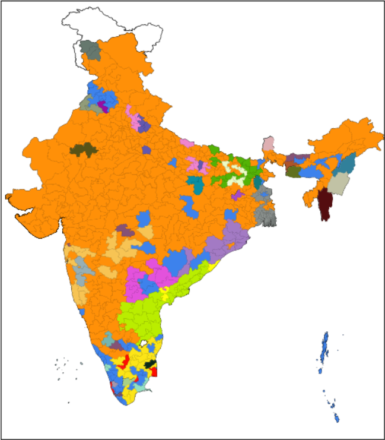
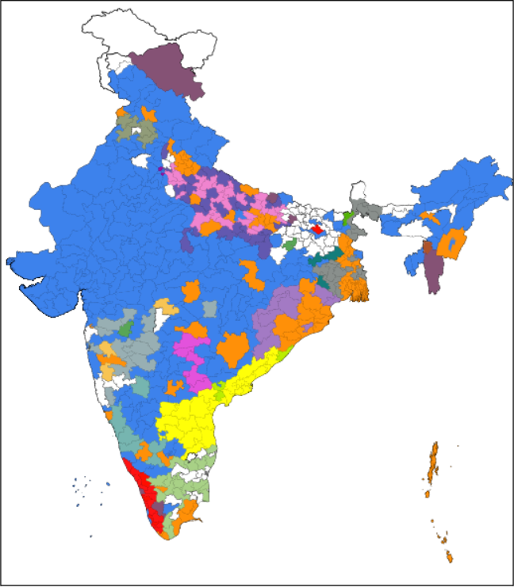

# 2019_General_Elections_India_Map_visualizer
2019 general elections visualization through india map code in python
  python program to visualize 2019 general election data:
  ## largest party:
  
  ## secound largest party:
  
